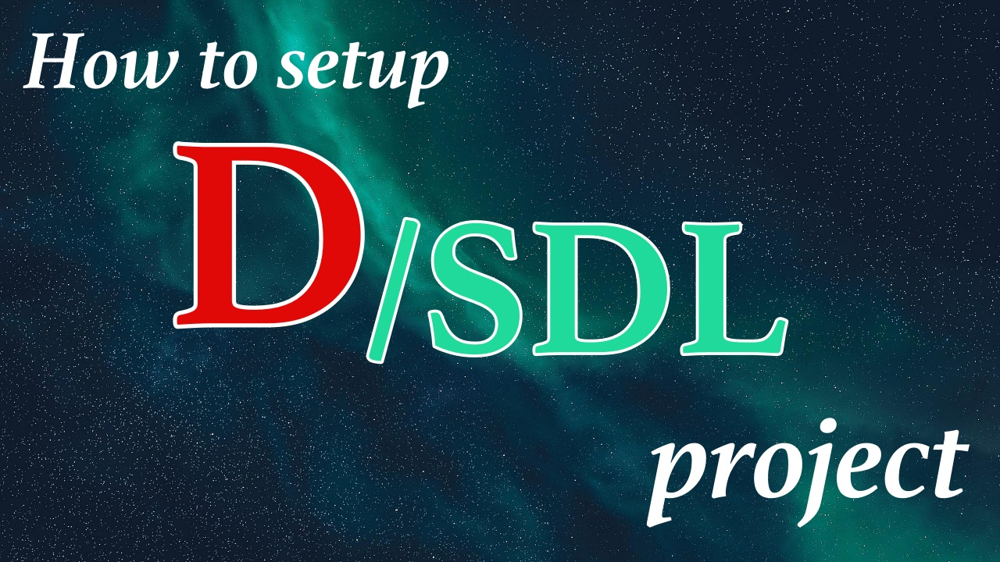

# D/SDL2 project template
This is a project template for D and SDL2 with DUB. It contains code for dynamically loading and initialization of the following libraries:
```
- SDL2
- SDL_Image
- SDL_TTF
- SDL_Mixer
- SDL_Net
```
Check out the `dub.json/dub.sdl` and `source/app.d` files for more info.



### Required toolchain
* [D](https://dlang.org/download) compiler
* [DUB](https://dub.pm/) package manager

### Dependencies
D uses the [bindbc-sdl](https://github.com/BindBC/bindbc-sdl) package. It is handled by DUB automatically. Please, make sure you have installed the libraries mentioned above. If you don't need all of them, then remove those parts from the code.

Modify your config file:
```
// dub.json
"dependencies": {
    "bindbc-sdl": "~>1.2.1"
},
"versions": ["SDL_2020", "SDL_Image", "SDL_TTF", "SDL_Mixer", "SDL_Net"]
```
```
// dub.sdl
dependency "bindbc-sdl" version="~>1.2.1"
versions "SDL_2020" "SDL_Image" "SDL_TTF" "SDL_Mixer" "SDL_Net"
```

### Compiling and running
```
dub --build=release
```
`--build=release` is optional. It will compile and run the project.

### LICENSE
All code is licensed under MIT.
